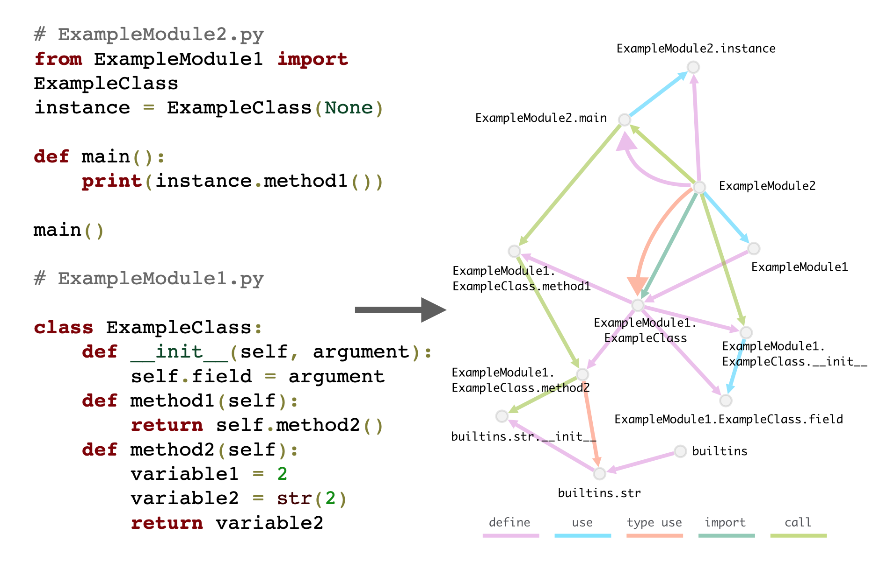

# Source Graph Dataset

This repository contains the files for source graph dataset described in [Representing Programs with Dependency and Function Call Graphs for Learning Hierarchical Embeddings]().

    

## Data

You can download the current version of graphs using the links below

- [Python](https://github.com/VitalyRomanov/source-graph-dataset/tree/master/Python)
- [Java](https://github.com/VitalyRomanov/source-graph-dataset/tree/master/Java)

## Methodology 

- All graphs were create with the help of open-source indexing tool [Sourcetrail](https://github.com/CoatiSoftware/Sourcetrail)
- The types of nodes and edges extracted with the help of Sourcetrail are listed in the description page for each language (see download links above)

## Future Work

- Add AST edges to the graphs